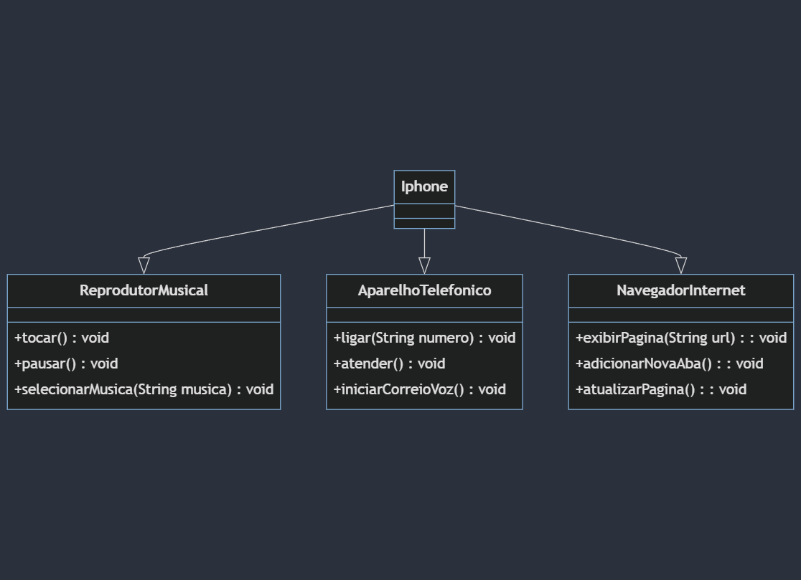

# Diagrama UML Iphone

Diagrama criado de acordo com o solicitado no desafio: 
https://github.com/digitalinnovationone/trilha-java-basico/tree/main/desafios/poo

Link com o Diagrama:
https://mermaid.live/edit#pako:eNp1ksFOwzAMhl-lyqkT2wv0gDTBZQcmxBCnXrzEay3SuHKTCjb67mRtQUUZOcXOL_-fHV-UZoOqUNpC1z0SVAJN6bJ4dm3NDrPN5us-e8FW2ATP8hQ60mBTybYFQVvzK1o8sSPNqWYPPVZgWHbOozj0k2T0Tj0u0-v13HnWIPkq65nMIt1C6G7luwihiR3MtfKDF3JV1ozRUj4sEdIelgyWqug1V3KhQeHEGDw6gzeIKFYjkAcWQeI3Puf_UiRTWkLgBx1JnqEi99tVELsqEhJD0wT23MP2CPkNiQ9g6Qw_5f4oBrVWscUGyMT1GBFK5WtssFRFvBqQ91KV7qqD-GuHT6dV4SXgWgmHqlbFCWwXo9CaOJZ5tybJ8A36Ys1t
